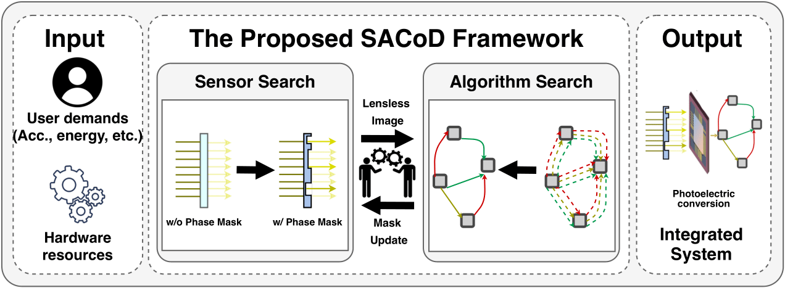
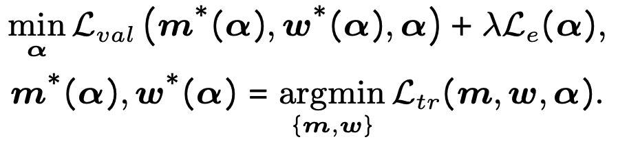
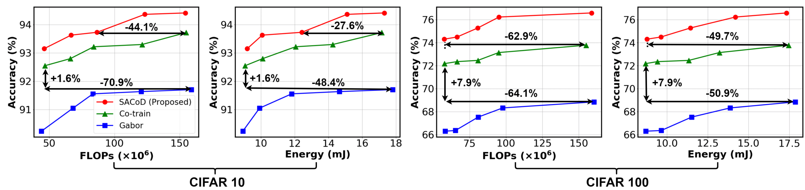
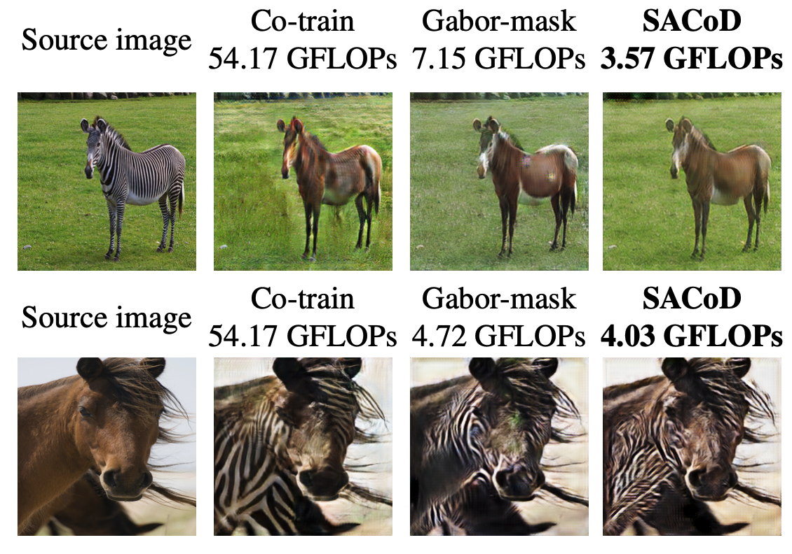
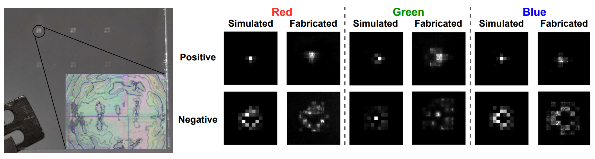

# SACoD: Sensor Algorithm Co-Design Towards Efficient CNN-powered Intelligent PhlatCam

Yonggan Fu, Yang Zhang, Yue Wang, Zhihan Lu, Vivek Boominathan, Ashok Veeraraghavan, Yingyan Lin

Accepted at ICCV 2021 [[Paper Link]](https://openaccess.thecvf.com/content/ICCV2021/papers/Fu_SACoD_Sensor_Algorithm_Co-Design_Towards_Efficient_CNN-Powered_Intelligent_PhlatCam_ICCV_2021_paper.pdf).


## Overview

There has been a booming demand for integrating Convolutional Neural Networks (CNNs) powered functionalities into Internet-of-Thing (IoT) devices to enable ubiquitous intelligent "IoT cameras". This work proposes ***SACoD***, a Sensor Algorithm Co-Design framework to develop more efficient CNN-powered
PhlatCam. In particular, the mask coded in the PhlatCam sensor and the backend CNN model are jointly optimized in terms of both model parameters and architectures via differential neural architecture search. Extensive experiments including both simulation and physical measurement on manufactured masks show that the proposed
SACoD framework achieves aggressive model compression and energy savings while maintaining or even boosting the task accuracy.

<p align="center">
  
</p>


## Method
We co-optimize the phase mask, network architecture, and model weights via a differentiable search process:

<p align="center">
  
</p>

More details and illustrations can be found in [our paper](https://openaccess.thecvf.com/content/ICCV2021/papers/Fu_SACoD_Sensor_Algorithm_Co-Design_Towards_Efficient_CNN-Powered_Intelligent_PhlatCam_ICCV_2021_paper.pdf).

## Results

### Evaluation on CIFAR-10/100
The trade-off between accuracy and FLOPs/energy:

<p align="center">
  
</p>

### Visual Quality on Unpaired Image Translation Tasks
Benchmark the visual quality of different imaging systems:

<p align="center">
  
</p>

### Visualization of Fabricated Masks
Visualization of the physically fabricated masks and the corresponding Point Spread Functions (PSFs):

<p align="center">
  
</p>


## Code Usage
A two-stage process is needed to generate the final imaging system, i.e., the search and training stage. The corresponding settings are specified in `config_search.py` and `config_train.py`, respectively. Users should modify the settings like dataset / data path in these two config files according to the demands.

### Prerequisites
See `env.yml` for the complete conda environment. Create a new conda environment:
```
conda env create -f env.yml
conda activate pytorch
```

### Search

To search for an optimal sensor/network for CIFAR-10/CIFAR-100, modify the `dataset` and `trained_mask` (whether to start from a pre-defined mask) fields in `config_search.py` and run:

```
python train_search.py
```

### Train

To train the sensor/network obtained from the search stage, modify the `dataset`, `trained_mask`, and `load_path` fields in config_train.py and run:

```
python train.py
```

### Baselines

To search/train a network with gabor mask, go to the `gabor` folder, and modify `config_search.py` and `config_train.py` accordingly and run `python train_search.py` to search for gabor-mask-based model or run `python train.py` to train the searched system.

To co-train a mask and a fixed network, go to the "co-train" folder, and run `python main.py [args...]`. In the arguments, you can specify the number of masks to use and the dataset to use.

## Pretrained Models

The pretrained models for CIFAR-10/CIFAR-100 (with the highest accuracy) are provided in the `pretrained` directory.

## Citation
```
@inproceedings{fu2021sacod,
  title={SACoD: Sensor Algorithm Co-Design Towards Efficient CNN-powered Intelligent PhlatCam},
  author={Fu, Yonggan and Zhang, Yang and Wang, Yue and Lu, Zhihan and Boominathan, Vivek and Veeraraghavan, Ashok and Lin, Yingyan},
  booktitle={Proceedings of the IEEE/CVF International Conference on Computer Vision},
  pages={5168--5177},
  year={2021}
}
```
